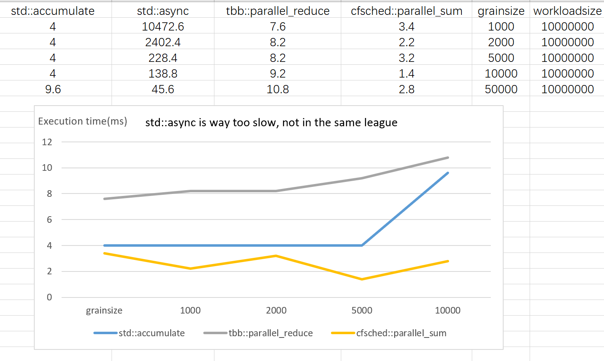

# CFSched: An Efficient Cache-friendly Work-stealing Task Scheduler

[](https://travis-ci.org/wjp-release/cfscheduler)
[](https://ci.appveyor.com/project/wjpjw/cfscheduler)


# What is cfsched
It's like go-routine(in golang), or juc(java.util.concurrent)'s threadpool, a user-level work-stealing task pool in C++11. 

# How to build it 
## Build Samples and Tests
```
cd cfsched/scripts
./build_min_release_ninja 
or 
./build_test_release_ninja 
```
## Build Benchmarks
You need to have Intel tbb installed at /usr/local(or modify include/link paths in benchmarks/CMakeLists.txt).
```
cd cfsched/scripts
./build_bench_release_ninja.sh
or
./build_all_release_ninja.sh
```

# Benchmarks
In our benchmark experiment(See Benchmarks.md), we generate a large array of random integers and try to calculate their sum in parallel. This experiment has negligible computation overhead(add two integers) and therefore its running time could reflect the overall scheduling efficiency.

In our benchmarks, we compare tbb::parallel_reduce, std::async, and cfsched::parallel_sum. They all use the same algorithm specified in https://en.cppreference.com/w/cpp/thread/async.

Our results are shown in the following figure.




